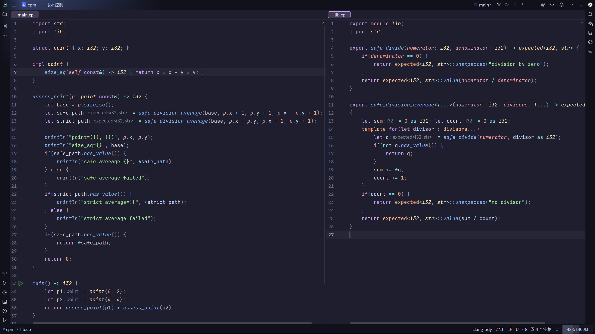

# KCP

KCP is a compiler project for the KCP programming language. The repository contains the language design, frontend, semantic analysis, IR and LLVM lowering, runtime support, standard library, examples, documentation, and CLion integration.



## Overview

The compiler is organized as a staged native-code toolchain:

- `source`, `preprocessor`, and `lexer` preserve source locations and produce diagnostics-friendly token streams.
- `parser` builds the KCP syntax tree from modules, declarations, statements, expressions, and types.
- `semantic` resolves names, checks types, instantiates generics, validates concepts, and lowers language rules into typed compiler state.
- `codegen` translates checked programs through IR and LLVM.
- `runtime` defines the ABI surface used by generated programs.
- `std` provides the first standard library modules written in KCP.

The project also includes a documentation site, runnable examples, regression tests, and an IntelliJ/CLion language plugin.

## Installation

KCP publishes Linux packages and a CLion language plugin from tagged releases. The current release page is:

<https://github.com/kkkzbh/KCP/releases/tag/0.1.0>

The compiler package installs:

- `/usr/bin/kcp`
- `/usr/lib/kcp/libcp_runtime.a`
- `/usr/lib/kcp/std`

The installed compiler is configured to find the packaged runtime and standard library automatically. Generated binaries still use `clang` for object generation and linking, so install `clang` if your package manager does not pull it in.

### Fedora

Use the Fedora repository:

```bash
sudo curl -L -o /etc/yum.repos.d/kcp.repo \
  https://raw.githubusercontent.com/kkkzbh/KCP/master/docs/install/kcp-fedora.repo
sudo dnf install kcp
```

Or install the RPM directly from a release:

```bash
sudo dnf install ./kcp-0.1.0-1.fc44.x86_64.rpm
```

### Debian and Ubuntu

Download the `.deb` from the release page, then install it:

```bash
sudo apt install ./kcp_0.1.0-1_amd64.deb
```

### Arch Linux

Download the pacman package from the release page, then install it:

```bash
sudo pacman -U ./kcp-0.1.0-1-x86_64.pkg.tar.zst
```

### CLion Plugin

The plugin is available on JetBrains Marketplace:

<https://plugins.jetbrains.com/plugin/32138-kcp-language-support>

It provides `.cp` file type support, syntax highlighting, semantic diagnostics, navigation, rename support, type hints, and run configurations backed by the bundled native KCP tools.

The release ZIP is also attached to GitHub releases as `kcp-clion-plugin-<version>.zip`.

### Windows

Windows packages are not published yet. The planned release shape is:

- a GitHub Release `.exe` installer or portable `.zip` containing `kcp.exe`, the runtime archive, and `std`
- a `winget` manifest after the Windows artifact is stable and installable without manual path repair

The main blocker is validating the compiler, runtime archive, standard library discovery, and `clang` linking path on Windows CI. Until that is done, Linux packages are the supported install path.

## Quick Start

Create `hello.cp`:

```cp
import std;

main() -> i32
{
    println("hello from {}", "KCP");
    return 0;
}
```

Build and run it:

```bash
kcp hello.cp -o hello
./hello
```

Useful compiler options:

```bash
kcp --help
kcp hello.cp --emit ll -o hello.ll
kcp hello.cp --emit obj -o hello.o
kcp hello.cp --release -o hello
kcp hello.cp --verbose -o hello
```

For multi-file modules, pass the entry file and let the compiler resolve imports from the current directory, the input file directories, and the installed standard library:

```bash
kcp main.cp -o app
```

If you are using an unpacked custom standard library or runtime, override the installed paths:

```bash
CP_STDLIB_ROOT_PATH=/path/to/std \
CP_RUNTIME_LIBRARY_PATH=/path/to/libcp_runtime.a \
kcp main.cp -o app
```

## Language

KCP is a statically typed systems language with explicit modules, value-oriented aggregates, generic programming, and predictable low-level interop.

Current language areas include:

- modules, imports, exports, and name visibility
- structs, impl blocks, constructors, destructors, member functions, and UFCS
- strong integer enums, variants, payload cases, and `match`
- references, pointers, arrays, tuples, ownership, move, and `like&`
- lambdas, function values, captures, and closure checks
- generic functions, generic types, parameter packs, and `template for`
- concepts, associated types, default implementations, and constrained APIs
- operator overloading, explicit casts, opaque aliases, and `extern "C"`

Example:

```cp
import std.core.option;

variant event {
    quit;
    key(char);
    resize(i32, i32);
}

score(value: event) -> i32
{
    return match value {
        .resize(width, height) => width + height,
        .key(code) => 1,
        .quit => 0,
    };
}

main() -> i32
{
    let some = optional<i32>::some(20);
    let none = optional<i32>::none;
    return some.value_or(0) + none.value_or(10) + score(event::resize(5, 7));
}
```

More examples are available under `design/examples/`.

## Standard Library

The standard library is implemented as ordinary KCP modules. It currently includes:

- `std.core`: `optional`, `expected`, iterator protocols
- `std.memory`: raw buffers and spans
- `std.collections`: `vector`, ordered `map`, ordered `set`
- `std.text`: `str` and owning `string`
- `std.ranges`: sources, lazy adapters, and terminals
- `std.meta`: type queries and callable concepts
- `std.compare`: comparison categories and ordering objects
- `std.algorithm`: sorting algorithms
- `std.io`: formatting and output
- `std.fs`: synchronous file IO

## Repository Layout

| Path | Contents |
| --- | --- |
| `compiler/` | command-line compiler entry points |
| `source/` | source text, spans, and location utilities |
| `preprocessor/` | source normalization before lexing |
| `lexer/` | tokenization and lexical diagnostics |
| `parser/` | parser, syntax tree, and parse diagnostics |
| `semantic/` | semantic analysis, types, generics, and language rules |
| `codegen/` | IR and LLVM code generation |
| `runtime/` | runtime ABI documentation and support |
| `std/` | KCP standard library source |
| `design/` | language documentation and examples |
| `clion-plugin/` | CLion plugin for KCP language support |
| `test/` | compiler, library, parser, lexer, and integration tests |

## Building From Source

```bash
cmake -S . -B build -G Ninja
cmake --build build
ctest --test-dir build --output-on-failure
```

Build only the compiler:

```bash
cmake --build build --target kcp
```

Build release packages from an already configured CMake tree:

```bash
scripts/package-linux.sh \
  --build-dir build \
  --version 0.1.0 \
  --out-dir dist/release
```

Run the deterministic style checks:

```bash
python3 .codex/skills/cp-code-style/scripts/check_cp_style.py
```

## Documentation

The language documentation is maintained as a VitePress site:

```bash
cd design
npm run dev
```

Useful entry points:

- [Language guide](design/docs/index.md)
- [Examples](design/docs/examples.md)
- [Standard library notes](std/README.md)
- [Runtime ABI](runtime/abi.md)
